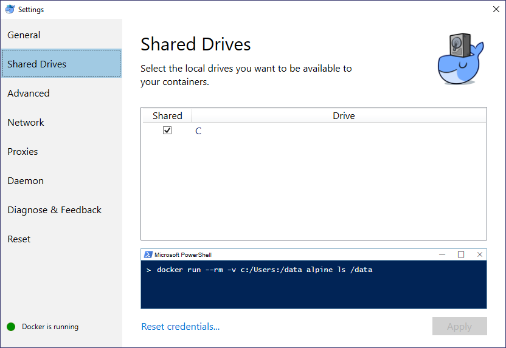

<h1 align="center"></h1>
<h4 align="center">An automatic algorithm evaluation system </h4>
<br>

## System instalation for Windows system

1. **Create ALGator folder**

    We will refere to this folder as `<algator_root>` folder

2. **Download ALGator.zip** file from GitHub

    ```
    curl -L -O https://raw.github.com/ALGatorDevel/Algator/master/ALGator.zip
    ```

3. **Unpack ALGator.zip** file to `<algator_root>`

    ```
	C:\> cd <algator_root>
	C:\algator_root> unzip ALGator.zip
	```


4. **Set environment variables** 

   In Environment Variables (Start -> Edit the system environment variables) add variables or type into command prompt:

   ```
    setx ALGATOR_ROOT "<algator_root>"
    setx CLASSPATH "%CLASSPATH%;%ALGATOR_ROOT%/app/ALGator/ALGator.jar"
   ```

   **Note**: in the first line change the `<algator_root>` with the name of 
   your ALGator folder.


5. **To test correctness** of the instalation, type

    ```java algator.Version``` 

    into command prompt


6. **Install Cygwin and rsync**
    - From https://cygwin.com/install.html install cygwin and rsync.

    - Add ```C:\cygwin64\bin\``` to PATH in system environment. To test it run ```rsync``` in command prompt.


7. **Install local web server to show ALGator's results**

   To show the results of ALGator's execution in a web browser, you need to 

   - Install the docker for Windows (see https://docs.docker.com/install/ for details) 

   - Use Linux containers instead of windows ones

   - If Docker asks for Hyper-V allow docker to install it

   - Enable shared drives as on picture or disk on your preference
     ​
     

     ​

   - Run the command

     ```docker run --mount type=bind,source=%ALGATOR_ROOT%/data_root,target=/home/algator/ALGATOR_ROOT/data_root -p 8081:8081 algator/algatorweb```

   - Open a web browser and type in the following address

     http://localhost:8081/

   Note: in the ALGator.zip there are two example projects: BasicSort and BasicMatrixMul.
   You can browse the results of these projects before creating your own project.

   When facing a problem with shared drives, try <a href="http://peterjohnlightfoot.com/docker-for-windows-on-hyper-v-fix-the-host-volume-sharing-issue/">this.</a>
   
