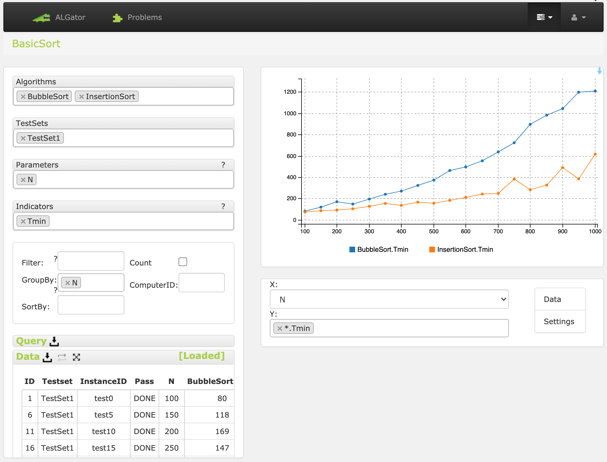

  <h1>Uporaba sistema <span class=algator>ALGator</span></h1>
  <hr>
  <br>
  
Sistem <span class=algator>ALGator</span> uporabljamo s pomočjo batch datotek, ki se ob namestitvi ([linux](/dist/htmldoc/install_linux.md) | [windows](/dist/htmldoc/install_windows.md)) samodejno prenesejo v folder ``<algator_root>/data_root/bin``. Datoteke poganjamo "ročno" v lupini, v okolju Windows pa lahko tudi z dvoklikom na ikono skripte v Raziskovalcu. Uporaba skript v lupini se v okoljih Linux in Windows razlikuje le po končnici ``bat``, ki je dodana skriptam v Windows okolju. Tam torej, na primer,  namesto 
```
$ algator_start 
```
pišemo
```
C:\> algator_start.bat
```
Pred uporabo skript je treba poskrbeti, da je folder ``<algator_root>/data_root/bin`` dodan v okoljsko spremenljivko ``PATH``, oziroma, da se v lupini pred izvajanjem skript z ukazom ``cd`` premaknemo v ta folder. 


### Upravljanje s sliko ``docker`` 

Pred uporabo ostalih skript je treba s programom ``docker`` zagnati sliko sistema <span class=algator>ALGator</span>.
```
$ algator_start 
```
Vsebnik s to sliko lahko po koncu dela s sistemom <span class=algator>ALGator</span> ustavimo z ukazom
```
$ algator_stop 
```
Če se želimo prepričati, ali je slika sistema <span class=algator>ALGator</span> pognana, to storimo z ukazom 
```
$ algator_status 
```

### Verzija sistema

Verzijo sistema <span class=algator>ALGator</span> ter nastavitve poti do folderja, v katerem se nahajajo projekti, preverimo z ukazom
```
$ algator_version 
```

### Izvajanje algoritmov 
Izvajanje izbranih algoritov na testnih množicah izbranega projekta sprožimo z ukazom 
```
$ algator_execute
```
Pri izvajanju si pomagamo s stikali 
```
-a ... izbira algoritma (privzeto: vsi algoritmi)
-t ... izbira testne množice (privzeto: vse testne množice)
-m ... izbira načina izvajanja 
         - em  = indikatorj (privzeto), 
         - cnt = števci
         - jvm = števci izvajanje javanske zložne kode
-e ... brezpogojno izvajanje
-c ... brezpogojno prevajanje kode
-v ... količina izpisa (privzeto 0)
```
Vse algoritme na vseh testnih množicah projekta ``BasicSort`` poženemo z ukazom 
```
$ algator_execute BasicSort
```
<p style="float:rigth;"><a href="/dist/htmldoc/images/execute.png">Screenshot</a>
</p>

Če želimo na vseh testnih množicah izvesti le algoritem ``QuickSort`` poženemo
```
$ algator_execute BasicSort -a QuickSort
```
Če želimo preverite delovanje le na testni množici ``TestSet1``, pa poženemo
```
$ algator_execute BasicSort -a QuickSort -t TestSet1
```
Za več informacij o izvajanju in morebitnih napakah dodamo stikalo -v 2, takole:
```
$ algator_execute BasicSort -a QuickSort -t TestSet1 -v 2
```

### Prikaz in analiza rezultatov
Rezultate izvajanja (ki so se zapisali v datoteke v folderju ``PROJ-<P>/results``) lahko pregledujemo in analiziramo s pomočjo spletnega vmesnika. Tega poženemo z ukazom
```
$ algator_webpage
```
Nato v zavihku ``Problems`` izberemo projekt in opcijo ``Query editor``. V urejevalniki poizvedb izberemo algoritme, testne množice, parametre in indikatorje ter na podlagi podatkov, ki se izpišejo v tabeli, izrišemo graf.  

Spodnja slika prikazuje primer: v poizvedbo smo vključili algoritma ``BubbleSort`` in ``InsertionSort`` ter testno množico ``TestSet1``, med parametre smo vključili velikost problema ``N``, med indikatorje pa najkrajši čas izvajanja ``Tmin``. 

<p style="text-align:center;">

</p>
</body>
</html>

  