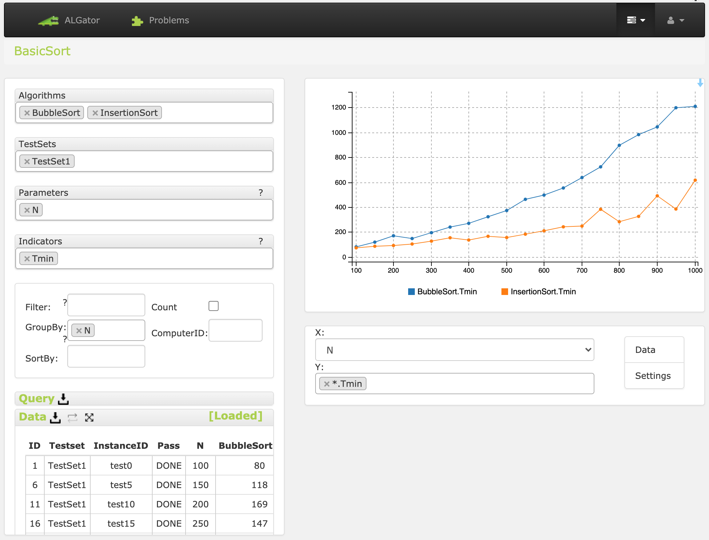

# Using the ALGator System

  

The ALGator system is utilized through a batch file, which is automatically downloaded to the folder `<algator_root>/data_root/bin` upon installation ([linux](/dist/htmldoc/install_linux.md) | [windows](/dist/htmldoc/install_windows.md)). The script is executed manually in the shell. Before using the script, ensure that the folder `<algator_root>/data_root/bin` is added to the `PATH` environment variable, or manually navigate to this folder using the `cd` command in the shell.


### Managing with Docker

### The ``docker``  image

Before using other scripts, the ALGator system image must be started using the `docker` program.
```
$ algator start 
```

The container with this image can be stopped using the following command:
```
$ algator stop 
```
To check whether the ALGator system image is running, use the command:

```
$ algator status 
```

### ALGator version

To check the version of the ALGator system and the path settings to the folder containing projects, use the following command:

```
$ algator version 
```

### Executing Algorithms

Execute selected algorithms on test sets of a chosen project with the following command:

```
$ algator execute
```

Switches can be used during execution:

```
-a ... choose the algorithm (default: all algorithms)
-t ... izbira testne množice (privzeto: vse testne množice)
-m ... izbira načina izvajanja 
         - em  = indikatorj (privzeto), 
         - cnt = števci
         - jvm = števci izvajanje javanske zložne kode
-e ... brezpogojno izvajanje
-c ... brezpogojno prevajanje kode
-v ... količina izpisa (privzeto 0)
```
Run all algorithms on all test sets of the ``BasicSort`` project with the command:

```
$ algator execute BasicSort
```
<p style="float:rigth;"><a href="/dist/htmldoc/images/execute.png">Screenshot</a>


To execute only the ``QuickSort`` algorithm on all test sets:

```
$ algator execute BasicSort -a QuickSort
```
To check the performance on the ``TestSet1`` test set only:

```
$ algator execute BasicSort -a QuickSort -t TestSet1
```
For more information on execution and potential errors, add the -v 2 switch:

```
$ algator execute BasicSort -a QuickSort -t TestSet1 -v 2
```

### Display and Analysis of Results

View and analyze the execution results (stored in files in the ``PROJ-<P>/results`` folder) through the web interface. Launch it with the command:

```
$ algator webpage
```
In the ``Problems`` tab, choose the project and select the ``Query editor`` option. In the query editor, select algorithms, test sets, parameters, and indicators. Based on the displayed data in the table, create graphs.


The image below shows an example: we included the ``BubbleSort`` and ``InsertionSort`` algorithms, the ``TestSet1`` test set, set the parameter to problem size ``N``, and the indicator to the minimum execution time ``Tmin``.

<p style="text-align:center;">

</p>
</body>
</html>

  